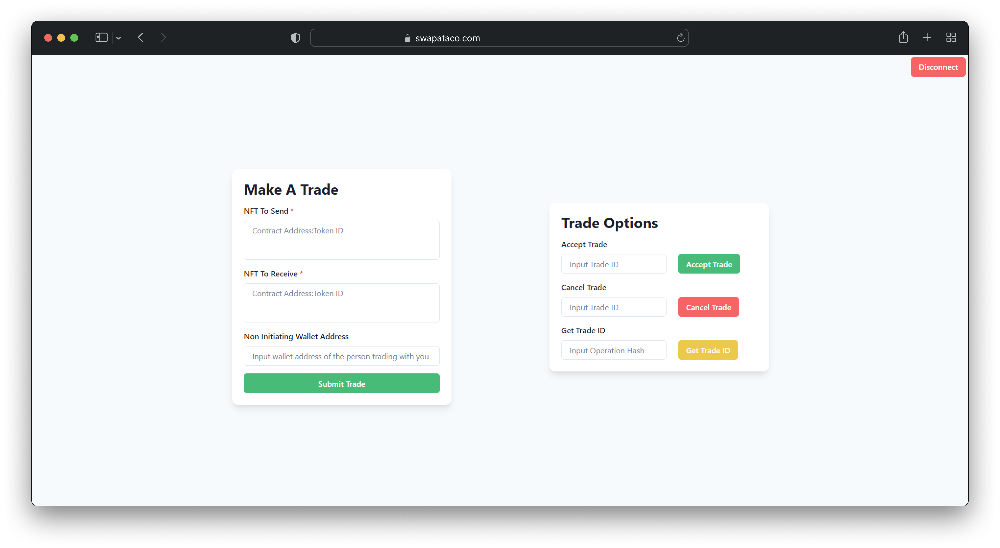

# Swap A Taco


## Purpose
[Swap A Taco](https://swapataco.com) is a modern, free to use, open source frontend to interact with the Tezos NFT trading [contract](https://tzkt.io/KT1XtJ6k51y7HpLFLTNv2wBYFhfVMZ6ow3Sz/operations/) created by [Javier Graciá Carpio](https://github.com/jagracar).

## Installation

```bash
$ git clone https://github.com/KingShibe/swapataco.git
$ cd swapataco
$ npm install
```

## Commands

To run a local development server:
```bash
$ npm start
```

To build a production version:
```bash
$ npm run build
```

## License

This repository is licensed under the GNU General Public License v3.0.